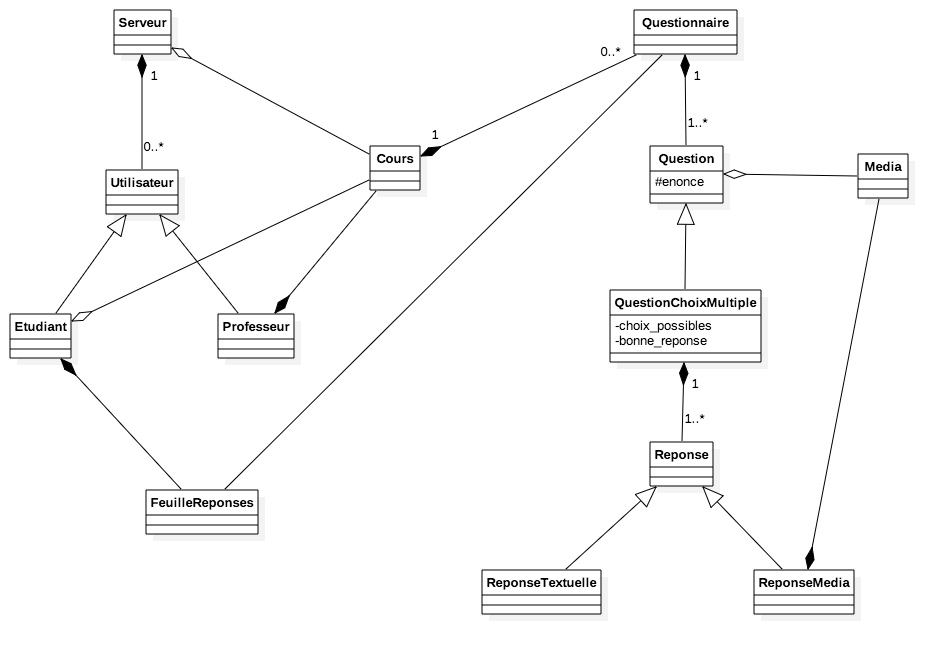

# Architecture

## Interprétation du sujet

Le projet *evaluator* consiste en la conception d'une plateforme d'évaluation automatique pour un personnel enseignant.

Les évaluations se feront au moyens de questionnaires réalisés par les enseignants. Ces même questionnaires pourront dans leur nature être aussi variés que possibles.

Les utilisateurs ne doivent pouvoir réaliser que ce que leur statut leur permet. Par exemple, un étudiant ne peut en noter un autre et un enseignant ne peut répondre à un questionnaire.

Enfin, *evaluator* prendra l'aspect d'un service web facile d'utilisation à destination d'universités ou encore d'entreprises. Il doit donc respecter une conception client/serveur de type REST : l'interface utilisateur accessible par le client est séparée de celle du stockage des données.

La plateforme doit donc respecter un certain nombre d'objectifs, que ce soit pourses utilisateurs ou même pour ses concepteurs :

  * extensibilité : l'ajout de fonctionnalités utilisateur doit pouvoir se faire aisément.
  * modularité : l'extensibilité pourra être accomplie en partie grâce à la modularité du code de notre plateforme.
  * sécurité : grâce à un système d'authentification, les données sensibles et personnelles se doivent d'être correctement protégées.

## Concepts

Pour un projet de Programmation Orientée Objet Concept Avancés, il va de soi que nous allons tenter d'utiliser au mieux les possibilitées offertes par le langage pour concevoir la plateforme en tentant de respecter nos objectifs.

### Serveur

S'agissant d'une plateforme web, il nous faut matérialiser dans notre modèle de données une entité **serveur**. Cette dernière se fera instancier au lancement du programme et se chargera de gérer la plateforme au sens large.

### Utilisateurs

Ces utilisateurs peuvent être dans un premier temps soit des étudiants soit des enseignants. Ces 2 classes par la notion d'héritage récupèrent les attributs d'une classe plus générale nommée Utilisateur synthétisant les aspects les plus basiques (identité, mot de passe, contacts...)

### Cours

Les cours sont les ressources principales de la plateforme. Un étudiant, fraichement enregistré s'y connectant doit pouvoir voir instantanément les cours proposés sur la plateforme. Une fois inscrit à un cours, il peut y consulter les ressources et voir les questionnaires associés.

### Questionnaires

Les questionnaires peuvent avoir de multiples formes. Il peut s'agir simplement de QCM, ou de simples rédactions. Cependant, on peut imaginer un questionnaire composé de plusieurs parties dont certaines sont des QCM et d'autres des rédactions. On peut également envisager des questionnaires où les réponses peuvent être des médias type sons, images ou code source qui se ferait évalué à la volée.

## Description de l'architecture

*Les diagrammes ci-dessous ne sont pas finaux.*

### Diagramme de cas d'utilisations

Le diagramme de cas d'utilisations recense ce que l'on a énoncé précédemment.

Les acteurs du système seront principalement les étudiants et les enseignants.

Se connecter au système n'est pas essentiel pour accéder à la plateforme mais essentiel pour y participer car il nous faut identifier qui crée les cours et qui y participent.

Certaines actions sont bien évidemment dépendantes d'autres : un étudiant ne peut voir ses notes que s'il a participé à un questionnaire, et il ne peut participer à un questionnaire que s'il est inscrit à un cours. Ce dernier n'existe que si un enseignant l'a crée.

### Diagramme de classes

Le *point d'entrée du diagramme* est la classe **Serveur**. Cette dernière s'instancie à la création du programme et permet d'accéder aux différentes ressources accessibles pour gérer le programme tels la liste des utilisateurs ou la liste des cours disponibles.

La classe *Cours* comme son nom l'indique contiendra les informations sur les différents cours. Ils sont crées par les enseignants et sont composés eux mêmes de *Questionnaires*. Ces derniers sont composés de *Questions* qui est une classe abstraite : on trouvera le plus souvent sa sous-classe *QuestionChoixMultiple*.

Cela permet de générer des questionnaires variés qui peuvent comporter plusieurs parties dont une composée de questions à choix multiples et d'autres avec *Media* (voir partie Extensions).

Les médias quant à eux correspondent à des ressources stockées localement sur le serveur et qui rendent les questionnaires plus interactifs. Ils peuvent être liés à une question (où l'utilisateur pourrait sélectionner le média étant la bonne réponse) ou même à une réponse de l'utilisateur qui fournirait son média en tant que réponse finale (si le devoir demande d'uploader une image ou un fichier vidéo)..

## Extensions envisagées

Comme extension, nous envisageons de rendre les questionnaires plus vivants et interactifs en laissant la possibilité aux étudiants de soumettre des réponses plus évoluées que des choix prédéterminés.

Nous pouvons leur laisser la possibilité de soumettre directement un code source qui peut éventuellement être évalué. Ceci est rendu possible avec notre architecture actuelle car l'entité *Réponse* est destinée à être étendue. Nous pourrions créer une sous classe *ReponseCodeSource* qui s'attend à ce que l'étudiant soumette un code source dans un langage donné.

Par ailleurs, nous pouvons aussi proposer des questions avec médias, ces médias pouvant être des sons, vidéos ou bien autres. Cela est encore rendu possible grâce à l'existence de *ReponseMedia* qui peut contenir éventuellement plusieurs médias (classe *Media*) et ces derniers seront chargés et affichés dans le questionnaire.
